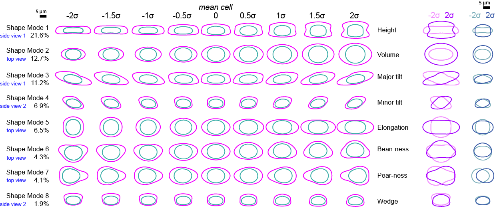

# cvapipe_analysis

## Analysis Pipeline for Cell Variance



Here you will find all the code necessary to i) reproduce the results shown in our paper [1] or ii) apply our methodology to you own dataset.

[1] - [Viana, Matheus P., et al. "Robust integrated intracellular organization of the human iPS cell: where, how much, and how variable?." bioRxiv (2020)](https://www.biorxiv.org/content/10.1101/2020.12.08.415562v1).

---

## Installation

First, create a conda environment for this project:

```
conda create --name cvapipe python=3.8
conda activate cvapipe
```

then clone this repo

```
git clone https://github.com/AllenCell/cvapipe_analysis.git
```

and install it with

```
cd cvapipe_analysis
pip install -e .
```

## Running the pipeline to reproduce the paper

This analysis is currently not configured to run as a workflow. Please run steps individually.

### 1. Download the single-cell image dataset manifest including raw GFP and segmented cropped images
```
cvapipe_analysis loaddata run
```

This command downloads the whole dataset of ~7Tb. For each cell in the dataset, we provide a raw 3-channels image containing fiducial markers for cell membrane and nucleus, toghether with a FP marker for one intracellular structure. We also provide segmentations for each cell in the format of 5-channels binary images. The extra two channels corresponds to roof-augmented versions of cell and intracellular structures segmentations. For more information about this, please refer to our paper [1]. Metadata about each cell can be found in the file `manifest.csv`. This is a table where each row corresponds to a cell.

**Importantly**, you can download a *small test dataset composed by 300 cells chosen at random* from the main dataset. To do so, please run

```
cvapipe_analysis loaddata run --test
```

This step saves the single-cell images in the folders `local_staging/loaddata/crop_raw` and `local_staging/loaddata/crop_seg`.

### 2. Compute single-cell features
```
cvapipe_analysis computefeatures run
```

This step extract single-cell features, including cell, nuclear and intracellular volumes and other basic features. Here we also use `aics-shparam` [(link)](https://github.com/AllenCell/aics-shparam) to compute the spherical harmonics coefficients for cell and nuclear shape. This step depends on step 1.

This step saves the features in the file `local_staging/computefeatures/manifest.raw`.

### 3. Compute shapemodes
```
cvapipe_analysis shapemode run
```

Here we implement a few pre-processing steps. First, all mitotic cells are removed from the dataset. Next we use a feature-based outlier detection to detect and remove outliers form the dataset. The remaining dataset is used as input for principal component analysis. Finally, we compute cell and nuclear shape modes. This step depends on step 2.

A couple of output files are produced on this step:

**Folder: `local_staging/shapemode/`**

- `manifest.csv`: Dataframe with mitotic and outlier cells removed. All cells in this dataframe are used as input for PCA.
- `shapemode.csv`: DataFrame with path to all animated GIFs and VTK mesh files produced in this step.

**Folder: `local_staging/shapemode/tables/`**

- `main_summary.csv`: Number of cells stratifyed by cell line, workflow, imaging mode and fov position.
- `outliers_summary.csv`: Number of cells identifyed as outlier in each cell line.
- `cell_stage_summary.csv`: Number of cells at different stages of cell cycle.

Views of tables above are also saved as JPG files in the same folder.

**Folder: `local_staging/shapemode/outliers/`**

- `manifest_outliers.csv`: Dataframe with cells flagged as outlier or not.
- `xx.png`: Diagnostic plots for outlier detection.

**Folder: `local_staging/shapemode/pca/`**

- `correlations_xx.png`: Correlation plots between principal components.
- `pca_xx.jpg`: Explained variance by each principal component.

**Folder: `local_staging/shapemode/avgcell/`**

- `xx.vtk`: vtkPolyData files corresponding to 3D cell and nuclear meshes. We recommend [Paraview](https://www.paraview.org) to open this files.
- `xx.gif`: Animated GIF illustrating cell and nuclear shape modes from 3 different projections.

### 4. Create parameterized intensity representation
```
cvapipe_analysis parameterize run
```

Here we use `aics-cytoparam` [(link)](https://github.com/AllenCell/aics-cytoparam) to create parameterization for all the single-cell data. This steps depends on step 2.

**Folder: `local_staging/parameterization/`**

- `manifest.csv`: Dataframe with the paths to parameterized intensity representation of each cell.

**Folder: `local_staging/parameterization/representations/`**

- `xx.tif`: Multichannels TIFF image with the cell representation.

### 5. Create 5D hypterstacks
```
cvapipe_analysis aggregation run
```

This step generates aggregation of multiple cells representations and morph them into idealized shapes from the shape space. This step depends on steps 3 and 4.

**Folder: `local_staging/aggregation/`**

- `manifest.csv`: Manifest with path to hyperstack created in this step.

**Folder: `local_staging/aggregation/hyperstacks/`**

- `xx.tif`: 5D-hyperstacks. One file per shape mode, per image type (raw vs. segmentation) and per aggregation type (avg. vs. std.)

## Running the pipeline on your own data

**TBD**

***Free software: Allen Institute Software License***

